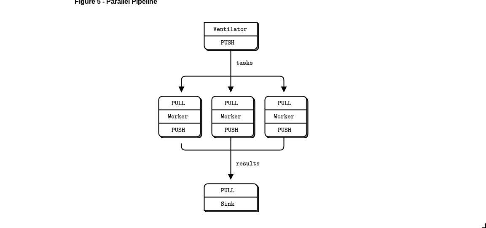
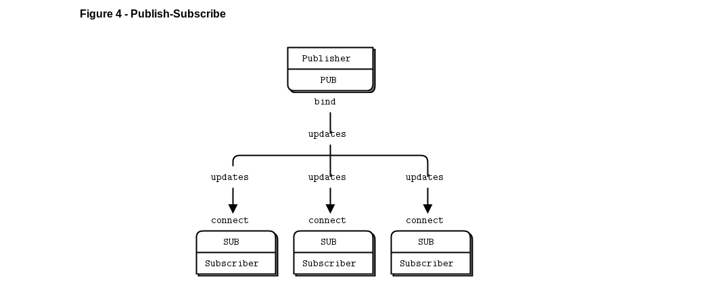
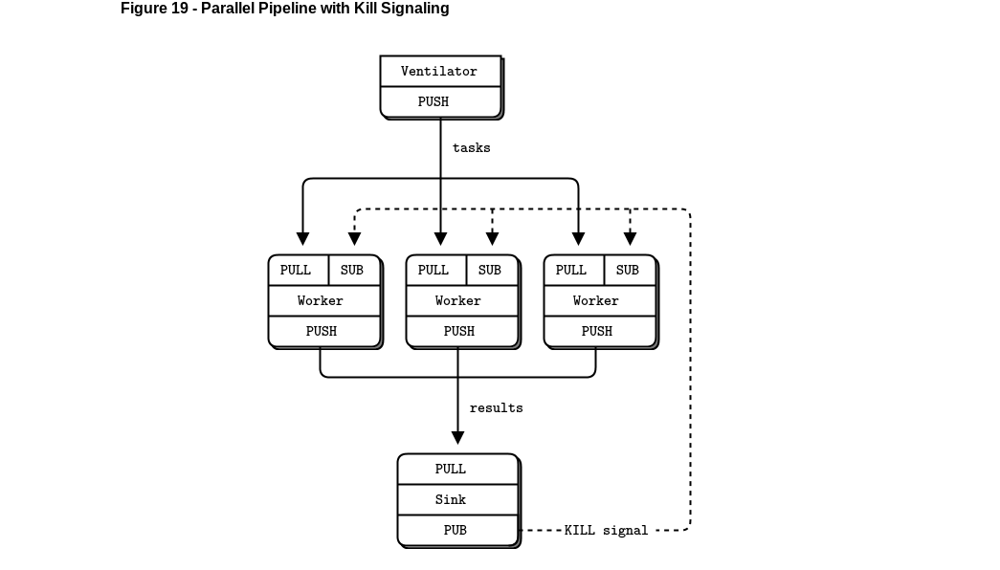

<!DOCTYPE HTML PUBLIC "-//W3C//DTD HTML 4.0 Transitional//EN">
<html>
<head>
	<meta http-equiv="content-type" content="text/html; charset=utf-8"/>
	<title></title>
	<meta name="generator" content="LibreOffice 6.1.5.2 (Linux)"/>
	<meta name="created" content="2019-09-11T11:18:54.868106624"/>
	<meta name="changed" content="2019-09-11T12:52:31.679538563"/>
	
</head>
<body lang="es-CO" link="#000080" vlink="#800000" dir="ltr">

 

Modelo
base explicado en clase: (PUSH-PULL)

 

 

Modelo
propuesto para la soluicion: (PUB-SUB)

 

 

 

 

 

 

 

 

Modelo
final: (PULL-PUSH AND PUB-SUB)

 

 

 

 

 

 

 

 

 

 

 

 

 

 

 

 

 

 

 

 

 

 

 

 

 

 

 

 

 

 

 

 

 

 

 

 

 

 

 

 

 

 

 

 

 

 

 

 

 

 

 

 

</body>
</html>